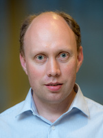
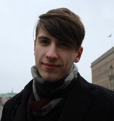
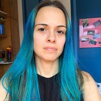
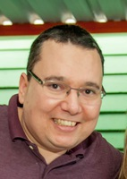
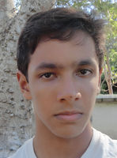
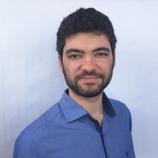

## World Final Class

We will have two international instructors this year.

### Andrew Stankevich

Andrew Stankevich will be the instructor of our fist week. His main acomplishes are:

* Associate professor at ITMO University, PhD
* Coach of 7 ICPC World Champion Teams, 13 World Finals Medalist Teams
* Coach and Leader of Russian IOI Team in 2018
* ICPC Silver Medalist 2000, Gold Medalist 2001
* Judge at Russian Olymiad in Informatics, NEERC
* Judge and Coach at Petrozavodsk Training Camp, Moscow Workshops Training Camps, Barcelona Bootcamp
* Author of 48 contests at Petrozavodsk Training Camps, more than 500 different problems

### Adam Bardashevich

Adam Bardashevich will bhe the instructor for our second week. His main acomplishes are:

* IOI gold medal at 2012
* ICPC WF 9th place at 2014
* ICPC WF 7th place at 2016

## Brazilian Final Class

We are inviting experienced Brazilian former competitors/coaches/trainers to create this class. We may have one distinct instructor per day.

### Juliana Freire

Engenheira de Computação e Mestre em Matemática pela PUC-Rio, PhD em Matemática por NYU. Participei da Maratona de Programação como integrante de equipe e posteriormente como coach; fomos qualificados para a final mundial em 2003. Atualmente sou professora no departamento de Matemática na PUC-Rio.

### Fabio Usberti

Atua como Professor Doutor em regime de dedicação exclusiva no Instituto de Computação (IC) da Universidade Estadual de Campinas (UNICAMP). Possui graduação em Engenharia Agrícola (2004) e Ciência da Computação (2010) pela UNICAMP. Concluiu o mestrado em Engenharia Elétrica (2007) e o doutorado em Engenharia Elétrica (2012) na Faculdade de Engenharia Elétrica e de Computação (FEEC) da UNICAMP. Técnico das equipes de maratona do IC-Unicamp em 2015, 2016 e 2018. Possui interesse nas áreas de Pesquisa Operacional e Otimização Combinatória.

### Jonathan Queiroz

Cientista da Computação pela UFBA, finalista mundial do ACM-ICPC em 2016 e 2017, medalhista de ouro e prata na Maratona de Programação.

### Gabriel Poesia

Gabriel é mestre em Ciência da Computação pela UFMG. Participou da Maratona durante toda a graduação, tendo sido finalista mundial em 2015. Continua competindo esporadicamente em competições online, obtendo a melhor colocação brasileira no round 2 do Google Code Jam 2018. Atualmente, tenta empreender ensinando programação a pessoas de outros backgrounds.
