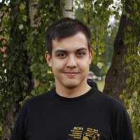
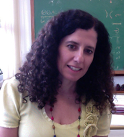

## World Final Class

We will have two international instructors this year.

### Artem Vasilev

Artem Vasilev will be the instructor for our first week. His main acomplishes are:

* Google Hash Code 2017 2nd place
* Open Cup multiple season winner as a part of Past Glory team
* ICPC 2015: World Champion, 2014: Bronze Medalist

### Ali Behjati

Ali Behjati will be the instructor for our second week. His main acomplishes are:

* ICPC World Final Bronze Medalist at 2019
* IOI Gold Medalist at 2016
* IOI Gold Medalist at 2015

## Brazilian Final Class

We are inviting experienced Brazilian former competitors/coaches/trainers to create this class. We will have four instructors this year.

### Jhúlia Graziella

Cientista da Computação pela UFU, participou de Olimpíadas de Matemática e Maratonas de Programação durante toda a graduação. Também participou de projetos de iniciação científica, monitorias e deu aulas num projeto que visava ensinar alunos de ensino fundamental e médio a programar. Atualmente trabalha como Engenheira de Software na Google e ama bolos.

### André Amaral

Engenheiro de Computação pela POLI-USP. Participou da OBI durante o Ensino Médio, e também participou da IOI 2012, e durante a graduação participou da Maratona de Programação sendo finalista mundial em 2013. Atualmente é professor no colégio ETAPA, onde seu foco é treinar alunos para a OBI e IOI. Nas horas vagas gosta de criar problemas, ano passado foi setter na Final Brasileira da Maratona. 

### Tiago Figueiredo

Aluno de Engenharia da Computação no final da graduação pela UFPE. Participou da Maratona de Programação em 2017 e 2018, medalhista de ouro em ambas. Atualmente é cocoach da UFPE. Está sempre disposto a trocar ideia sobre problemas, principalmente se for relacionado ao problema "Doce de Banana".

### Cristina G. Fernandes

Professora do Departamento de Ciência da Computação da Universidade de São Paulo (USP), onde ministra disciplinas como Estruturas de Dados, Análise de Algoritmos, Geometria Computacional, entre outras.   Recentemente ela ministrou uma disciplina sobre Estruturas de Dados Avançadas, baseada no curso de Erik Demaine (6.851: Advanced Data Structures).  Gosta de implementar, e sempre que pode olha o código desenvolvido pelos seus alunos e orientados.  Uma de suas citações favoritas é "Talk is cheap. Show me the code.", de Linus Torvalds.  Você pode encontrar mais informação sobre ela e o seu contato em sua [página](http://www.ime.usp.br/~cris/) na web.
