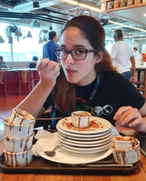
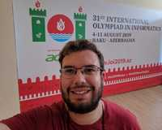

## World Final Class

We will have two international instructors this year.

### Ali Sharifi

Ali is an International Olympiad in Informatics (IOI) 2000 gold medalist, who graduated B.Sc. and M.Sc. of computer engineering from Sharif University of Technology and Ph.D. of Bioinformatics from University of Tehran. He conducted bioinformatics research in Royan Institute for Stem Cell Biology and Technology and also Max Planck Institute for Molecular Biomedicine, and postdoc of bioinformatics in Colorado State University. Since 2012, he has served as a member of the IOI International Scientific Committee (ISC), and the chairman of the ISC during 2018-2019. He is currently a faculty member of bioinformatics in Computer Engineering Department, Sharif University of Technology. 

### Ali Behjati

Ali Behjati will be the instructor for our second week. His main acomplishes are:

* ICPC World Final Bronze Medalist at 2019
* IOI Gold Medalist at 2016
* IOI Gold Medalist at 2015

## Brazilian Final Class

We are inviting experienced Brazilian former competitors/coaches/trainers to create this class. We will have four instructors this year.

### Jhúlia Graziella

Cientista da Computação pela UFU, participou de Olimpíadas de Matemática e Maratonas de Programação durante toda a graduação. Também participou de projetos de iniciação científica, monitorias e deu aulas num projeto que visava ensinar alunos de ensino fundamental e médio a programar. Atualmente trabalha como Engenheira de Software na Google e ama bolos.

### André Amaral

Engenheiro de Computação pela POLI-USP. Participou da OBI durante o Ensino Médio, e também participou da IOI 2012, e durante a graduação participou da Maratona de Programação sendo finalista mundial em 2013. Atualmente é professor no colégio ETAPA, onde seu foco é treinar alunos para a OBI e IOI. Nas horas vagas gosta de criar problemas, ano passado foi setter na Final Brasileira da Maratona. 

### Tiago Figueiredo
Coming Soon

### Cristina
Coming Soon
